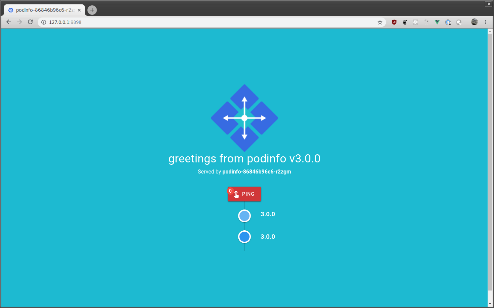
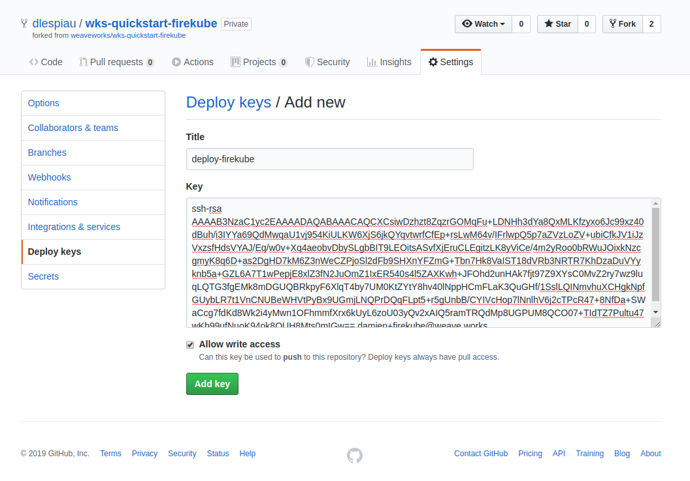

# Firekube

Firekube is a Kubernetes cluster working on top of [ignite][gh-ignite] and
[firecracker][gh-firecracker]. Firekube clusters are operated with
[GitOps][ww-gitops].

[ignite][gh-ignite] and [firecracker][gh-firecracker] only work on Linux as
they need [KVM][kvm]. Fortunately we will also work on macOS using
[footloose][footloose]: the Kubernetes nodes are then running inside
containers.

## Creating a Firekube cluster

1. Fork this repository.

1. Clone your fork and `cd` into it. Use the `SSH` git URL as the script will
push an initial commit to your fork:

   ```console
   git clone git@github.com:$user/wks-quickstart-firekube.git
   cd wks-quickstart-firekube
   ```

1. Start the cluster:

   ```console
   ./setup.sh
   ```

   This step will take several minutes.

1. Export the `KUBECONFIG` environment variable as indicated at the end of the installation:

   ```console
   export KUBECONFIG=/home/damien/.wks/weavek8sops/example/kubeconfig
   ```

Enjoy your Kubernetes cluster!

   ```console
   $ kubectl get nodes
   NAME               STATUS   ROLES    AGE     VERSION
   67bb6c4812b19ce4   Ready    master   3m42s   v1.14.1
   a5cf619fa058882d   Ready    <none>   75s     v1.14.1
   ```

[gh-ignite]: https://github.com/weaveworks/ignite
[gh-firecracker]: https://github.com/firecracker-microvm/firecracker
[footloose]: https://github.com/weaveworks/footloose
[kvm]: https://en.wikipedia.org/wiki/Kernel-based_Virtual_Machine
[ww-gitops]: https://www.weave.works/technologies/gitops/

## Watch GitOps in action

Now that we have a cluster installed, we can commit Kubernetes objects to the
git repository and have them appear in the cluster. Let's add
[podinfo][podinfo], an example Go microservice, to the cluster.

[podinfo]: https://github.com/stefanprodan/podinfo

```sh
curl -fLo podinfo.yaml https://raw.githubusercontent.com/stefanprodan/podinfo/master/kustomize/deployment.yaml
git add podinfo.yaml
git commit -a -m 'Add podinfo Deployment'
git push
```

A few seconds later, you should witness the apparition of a podinfo pod in
the cluster:

```console
$ kubectl get pods
NAME                       READY   STATUS    RESTARTS   AGE
podinfo-677768c755-z76xk   1/1     Running   0          30s
```

To view `podinfo` web UI:

1. Expose `podinfo` locally:

   ```
   kubectl port-forward deploy/podinfo 9898:9898
   ```

1. Point your browser to `http://127.0.0.1:9898`:

   

## Deleting a Firekube cluster

Run:

```console
./cleanup.sh
```

## Using a private git repository with firekube

To use a private git repository instead of a fork of `wks-quickstart-firekube`:

1. Create a private repository and push the `wks-quickstart-firekube`
   `master` branch there. Use the SSH git URL when cloning the private
   repository:

   ```
   git clone git@github.com:$user/$repository.git
   cd $repository
   git remote add quickstart git@github.com:weaveworks/wks-quickstart-firekube.git
   git fetch quickstart
   git merge quickstart/master
   git push
   ```

1. Create an SSH key pair:

   ```console
   ssh-keygen -t rsa -b 4096 -C "damien+firekube@weave.works" -f deploy-firekube  -N ""
   ```

1. Upload the deploy key to your private repository (with read/write access):

   

1. Start the cluster:

   ```console
   ./setup.sh --git-deploy-key  ./deploy-firekube
   ```

## Getting Help

If you have any questions about, feedback for or problems with `wksctl`:

- Invite yourself to the <a href="https://slack.weave.works/" target="_blank">Weave Users Slack</a>.
- Ask a question on the [#general](https://weave-community.slack.com/messages/general/) slack channel.
- [File an issue](https://github.com/weaveworks/wks-quickstart-firekube/issues/new).

Your feedback is always welcome!

## License

[Apache 2.0](LICENSE)
